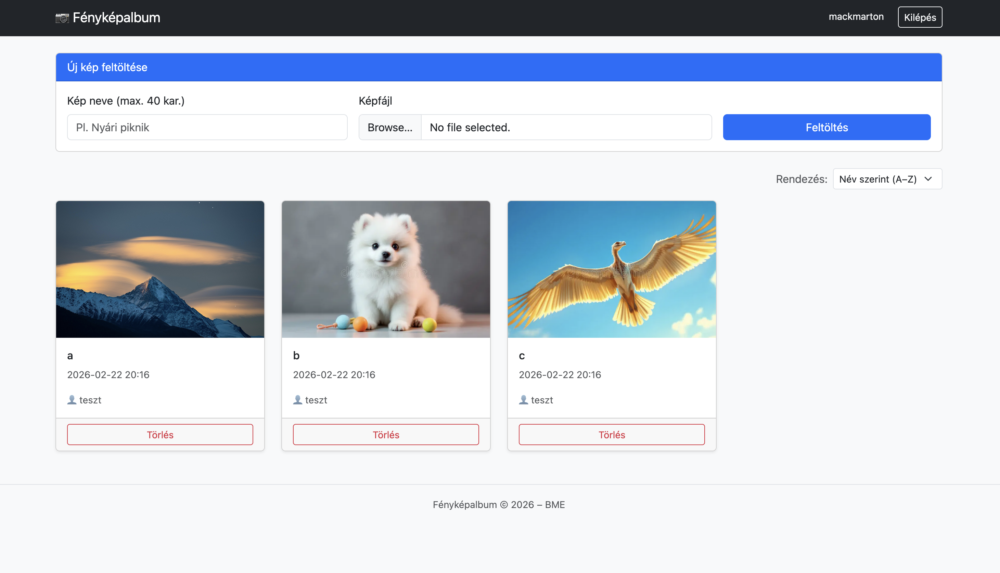

# 📷 Fényképalbum Alkalmazás

## Felhasználói dokumentáció

**Bejelentkezés nélkül:**
- A főoldalon látható az összes feltöltött kép
- A képek felett egy legördülő menüből választható a rendezés (név vagy dátum szerint)
- Egy képre kattintva megjelenik a nagyobb nézet a név és feltöltési dátum részletekkel
- Feltöltés és törlés funkciók nem érhetők el

**Bejelentkezés után:**
- A jobb felső sarokban megjelenik a felhasználónév és a "Kilépés" gomb
- A képlista felett megjelenik egy "Új kép feltöltése" kártya
- Kép feltöltésekor meg kell adni a kép nevét (maximum 40 karakter) és ki kell választani a fájlt
- A részletes képnézetben megjelenik a "Törlés" gomb, amellyel a kép eltávolítható

**Regisztráció:**
- A jobb felső sarokban lévő "Bejelentkezés" linkre kattintva, alul található a regisztrációs lehetőség
- Felhasználónév és jelszó megadása szükséges (felhasználónév maximum 20 karakter)
-----
## Architektúra dokumentáció

### Technológia Stack és szolgáltatók

- **Backend:** Java Spring Boot
- **Adatbázis:** Heroku Postgres (IaC által menedzselve)
- **Képtárolás:** Cloudinary (CDN)
- **Frontend:** JavaScript Single Page Application
- **PaaS szolgáltató:** Heroku
- **CI/CD & IaC:** GitHub Actions, HashiCorp Terraform, HCP Terraform

### API Végpontok

**Autentikáció:**
- `POST /api/auth/register` - Regisztráció
- `POST /api/auth/login` - Bejelentkezés
- `POST /api/auth/logout` - Kilépés
- `GET /api/auth/me` - Jelenlegi felhasználó

**Képek:**
- `GET /api/pictures` - Összes kép listázása (opcionális `sort` paraméter: `name` vagy `date`)
- `GET /api/pictures/{id}` - Kép részletei
- `POST /api/pictures` - Új kép feltöltése (csak bejelentkezve)
- `DELETE /api/pictures/{id}` - Kép törlése (csak bejelentkezve)

**Frontend:**
- `GET /` - Maga a felhasználói felület

### Biztonsági megoldások

Az alkalmazás biztosítja az adatok és felhasználók védelmét. A jelszavak tárolása egy hash algoritmussal történik, így a jelszavak soha nem kerülnek plain text formában tárolásra. A kommunikáció a Heroku -n való futtatásnak köszönhetően tikosítva, HTTPS protokollon keresztül történik.

Az autorizáció gondoskodik arról, hogy csak bejelentkezett felhasználók tölthessenek fel vagy törölhessenek képeket.

A bemenetek backend és frontend oldalon is validálásra kerülnek. 

## Infrastructure-as-Code (IaC) Munkamenet

A felhőbeli infrastruktúra (szerver, adatbázis, környezeti változók) automatizált felépítéséhez és naprakészen tartásához **Infrastructure-as-Code** megközelítést alkalmaztam. Ez kiküszöböli a manuális "kattintgatást" a szolgáltatói felületeken, és reprodukálhatóvá teszi a rendszert.

### Használt eszközök
* **HashiCorp Terraform:** Az infrastruktúra deklaratív leírására és módosítására.
* **HCP Terraform (Terraform Cloud):** Remote backendként szolgál a Terraform állapot felhőbeli, biztonságos tárolására. Ez a kulcsa annak, hogy a folyamatos frissítések során az **adatbázis és a benne lévő adatok ne törlődjenek**, az infrastruktúra folytonossága megmaradjon.
* **GitHub Actions:** Az automatizált CI/CD folyamatok vezérlésére (IaC telepítés, majd szoftver deploy).

### Konfigurált komponensek
A Terraform kód (`main.tf`) a következő erőforrásokat hozza létre és konfigurálja a Heroku platformon:
1. **Heroku App (`heroku_app`):** Az alkalmazás futtatókörnyezete (PaaS szerver).
2. **Heroku Postgres (`heroku_addon`):** Egy dedikált PostgreSQL adatbázis. A Terraform gondoskodik a függőségkezelésről, így a generált adatbázis hitelesítő adatai (`DATABASE_URL`) automatikusan "bedrótozódnak" a Heroku alkalmazás környezeti változói közé.

### Build és Deploy folyamat (CI/CD)

A fejlesztési folyamat teljesen automatizált a GitHub Actions segítségével. A `main` ágra történő minden egyes *push* esetén a következő lépések futnak le:
1. **Infrastruktúra ellenőrzése:** A GitHub Actions bejelentkezik a HCP Terraformba, és a `terraform apply` paranccsal frissíti/létrehozza a Heroku erőforrásokat a kód alapján.
2. **Szoftver telepítése:** Ha az infrastruktúra (és az adatbázis) készen áll, a pipeline egy natív `git push` parancs segítségével feltölti az alkalmazás forráskódját a Herokura, ami automatikusan lefordítja és elindítja az új verziót.